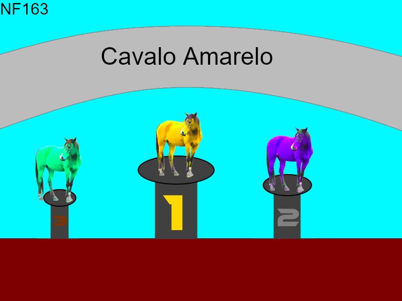

# The Horse Game
## Simulador de corrida equina utilizando threads feito para a disciplina de Sistemas Operacionais.
### O projeto Horse Game se trata de uma versão evoluida do clássico simulador de corrida equiniana feita com threads. Essa implementação na linguagem python faz uso da biblioteca pygame para programar a lógica do jogo e o uso de threads para mover os cavalos em tempo real, dando uma precisão nunca antes vista. O jogo também conta com um sistema de geração de partida aleatório, dando um id uníco pra cada um de seus games, permitindo que se lembre de um jogo especifico com o  código gerado no final da partida. Ele também conta com uma tela de vitória única feita com cuidado pelos nossos designers, dando a impressão que você está comemorando junto com os cavalos. A tela de vitória, que é dinamicamente gerada, é salva diretamente no seu hd, permitindo que você se recorde dos momentos de glória, e também de queda, de seus cavalos favoritos.

